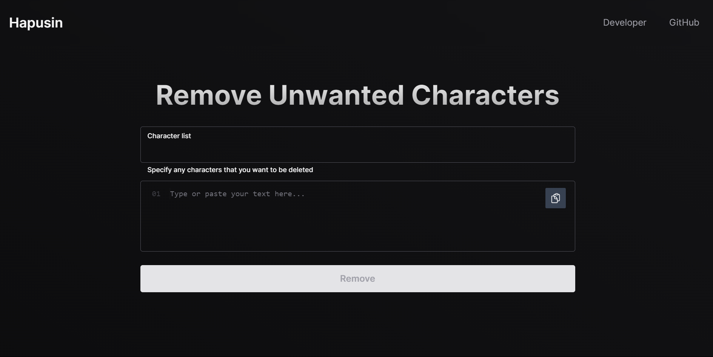

  <h1 align="center">Hapusin - Free Character Remover</h1>
  <h5>Use this text tool to remove specific unwanted characters or letters</h5>

  <a href="https://hapusin.vercel.app">Hapusin.</a>

 

Hapusin is a simple tool that allows you to remove any specific unwanted characters or letters from a text. Just type the characters you want to be removed in the text box and click remove. No need to add separators like commas or escape characters. There are also several templates readily available for you to use.

 

## Features

- **Easy to Use:** Simply type the characters you want to remove and click remove
- **No Separators Required:** No need to add separators like commas or escape characters
- **Templates:** Choose from several templates for common character removal tasks

## Built with

- [Next.js](https://nextjs.org)
- [tailwindcss](https://tailwindcss.com)
- Deployed on [Vercel](https://vercel.com)

## Get Started

To get started with this project, follow these steps:

1. Make sure you have Node.js installed on your machine.
2. Clone the repository.
3. Run `pnpm install` to install the project dependencies.
4. Run `pnpm dev` to start the development server.
